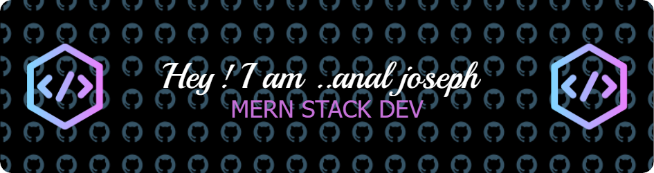

<!-- Header Image -->

### Aspiring MERN Stack Developer | BCA Student | Passionate Coder

  
  
  

---

<!-- Animated Introduction -->

  

---

### 🌱 I’m currently learning & using

 

<!-- 아이콘 총 모음 -->

 

### 🛠 Programming Languages

 

 

### 💻 Frontend Technologies

 

 

### ⌨️ Backend Technologies

 

    
 
 

### 📋 Configuration Management

 

 

### 🐬 Using IDE

 

 

### ✨ Featured Projects

  <a href="https://github.com/anal96/html-project-1" target="_blank">
    <h3>🌐 HTML Web Page</h3>
    
A HTML web page showcasing fundamental design and development skills.

  </a>
   
  <a href="https://github.com/anal96/chatbot-using-tkinder" target="_blank">
    <h3>🤖 Chatbot Using Python</h3>
    
An interactive chatbot built with Python and Tkinter for engaging user communication.

  </a>

### 📈 GitHub Stats

  
  
  

  
  

### 🚀 Contributions

  

---

### 🏆 GitHub Trophies

  

---

### 🌐 Connect with Me

  
  
  
  

---

### 📜 My Resume

  

<!-- Footer with Additional Links -->

  

<

